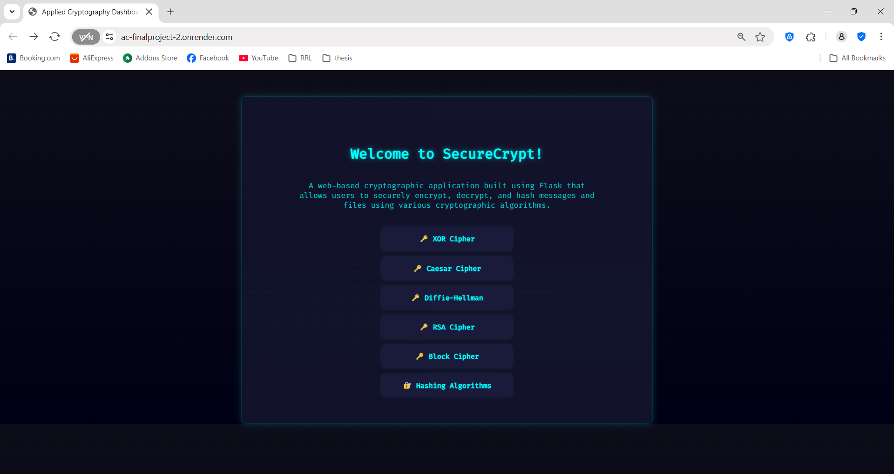
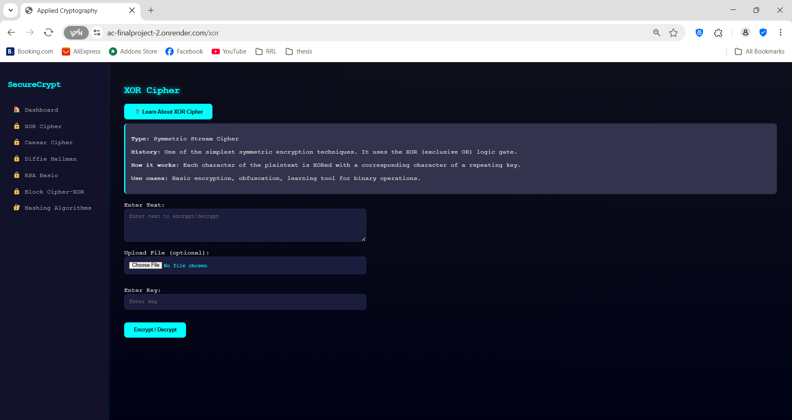
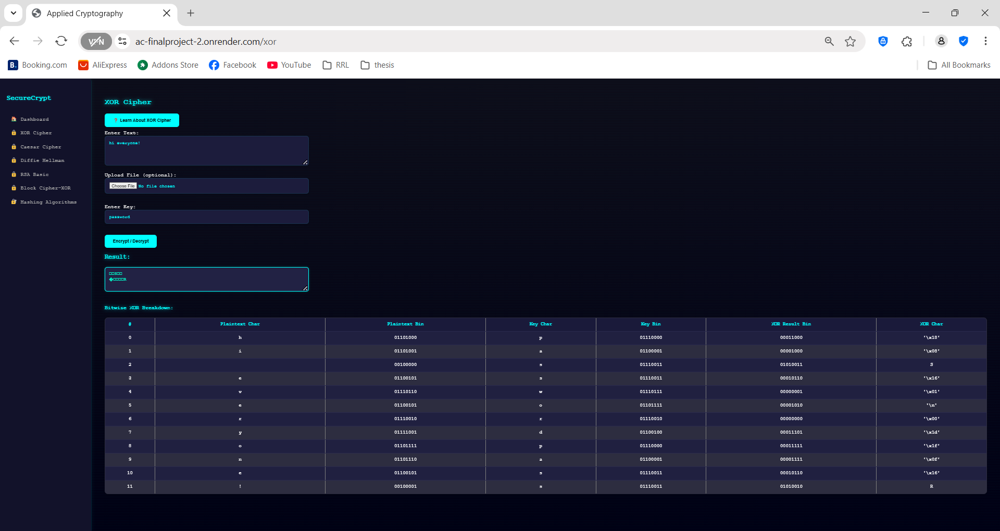
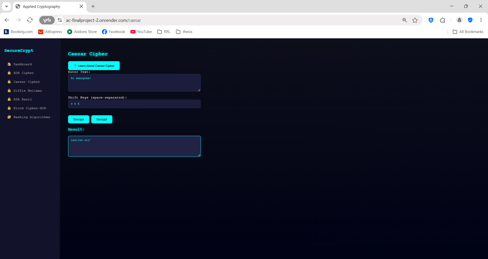
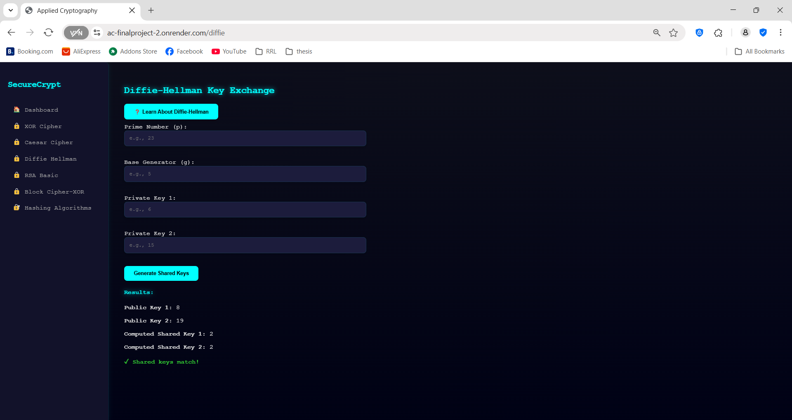
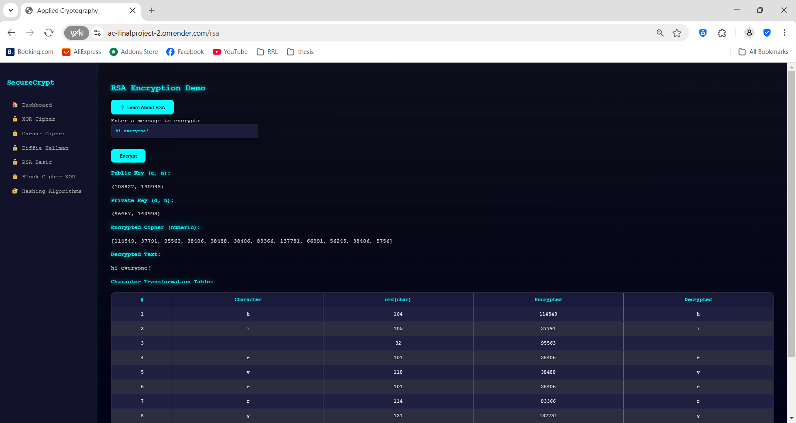
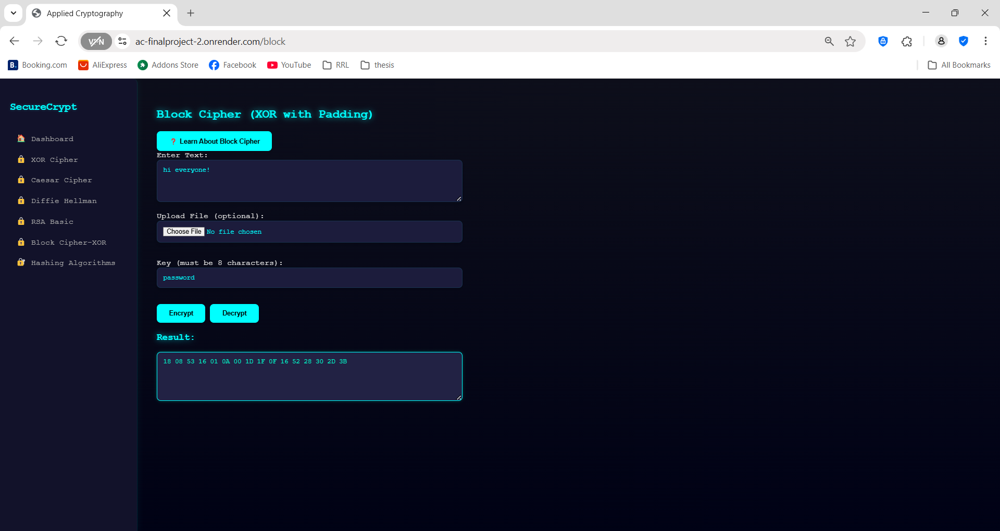
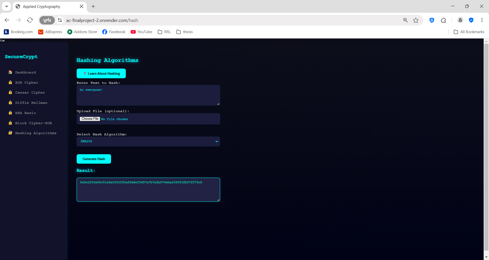

# AC-FinalProject

# 🔐SecureCrypt: A Cryptographic Web Application

**CSAC 329 – Applied Cryptography**

**Date:** May 2025  

---

## 👥 Group Members

- Garcia, Asi Neo
- Janda, Christian Paul 
- Mediado, Hyacinthe 
- Nanale, Krizia Belle 

---

## 📖 Introduction

**SecureCrypt** is a web-based cryptographic application built using Flask that allows users to securely encrypt, decrypt, and hash messages and files using various cryptographic algorithms. The application provides an intuitive UI for selecting and interacting with multiple symmetric, asymmetric, and hashing techniques. Cryptography is vital in protecting data confidentiality, integrity, and authenticity. In a digital age of increasing cyber threats, understanding and implementing cryptographic principles is fundamental to secure software systems.

---

## 🎯 Project Objectives

1. Implement and demonstrate at least 3 symmetric, 2 asymmetric, and 4 hashing cryptographic algorithms using Python.
2. Develop a user-friendly web interface for secure message and file processing using Flask.
3. Provide educational context and documentation about each cryptographic technique to enhance learning and usability.

---

## 💡 Discussions

The SecureCrypt application was developed to provide users with a hands-on platform for understanding and utilizing modern cryptographic techniques in a secure and interactive environment. By integrating multiple encryption, decryption, and hashing algorithms within a user-friendly web interface, the project aims to bridge the gap between theoretical cryptography and real-world application. Built using the Flask web framework, the application adopts a modular architecture that separates the frontend UI, backend logic, and cryptographic functions. This design ensures scalability, ease of maintenance, and clarity in both user experience and code structure. The user interface features a dark, cybersecurity-inspired theme with intuitive navigation, making it accessible to users with varying levels of technical knowledge.

From an educational and practical standpoint, SecureCrypt serves as both a learning tool and a secure application. It implements a wide range of algorithms, including **symmetric approaches** like *XOR and Caesar*; **asymmetric approaches** like *RSA and Diffie-Hellman*; and **hashing algorithms** such as *SHA-256, SHA-1, MD5, and BLAKE2*. Each algorithm is integrated using Python libraries like hashlib and pycryptodome, and is accessible via dedicated Flask routes that handle user input and display real-time cryptographic results. Through this approach, the application allows users to understand the strengths and limitations of each technique, experiment with encryption keys and plaintext, and observe the transformation of data in a secure environment. Overall, SecureCrypt emphasizes the importance of cryptographic literacy and demonstrates how foundational security principles can be applied in modern software systems.

In addition to its core cryptographic functionality, SecureCrypt also emphasizes the importance of user awareness and digital responsibility. By offering clear, accessible explanations of each algorithm’s purpose, background, and use case, the application encourages users to not only perform cryptographic operations but also understand why they matter in today’s digital landscape. This educational aspect is especially valuable for students and early-stage developers who are new to cybersecurity. Moreover, by supporting both classical and modern algorithms, the project provides historical context alongside contemporary relevance, showing how cryptography has evolved to meet increasingly complex security demands. Through its interactive design and well-documented features, SecureCrypt succeeds in transforming abstract security concepts into practical, hands-on experiences.

### ⚙️ Application Architecture and UI Choice

This web-based platform for cryptographic functionalities is built with the **Flask framework**, integrating the Render web service for cloud server. The architecture is developed modularly and in layers, so that the frontend (user interface), backend (Flask routes and logic), and the methods that perform cryptographic tasking are separated components within the system. Due to this modular design, the system allows for scaling, easy maintenance, and convenient debugging or future development tasks. The frontend has been rendered using HTML and CSS, while incorporating some custom styling to preserve a technically-modern dark themed user interface to reflect the secure and technical use of the application. Bright and neon accents (with an emphasis on cyan and orange) have been used for readability and for visual appeal; and to draw the user's eye towards interactive components like buttons or icons.

- **Backend Framework:** Flask (Python)
- **Frontend:** HTML5, Flask templates
- **Structure:**
  - `app.py`: Main application logic and routing
  - `algorithms/`: Contains all cryptographic function implementations
  - `templates/`: Holds UI templates
  - `uploads/`: Stores uploaded files temporarily
  - `static/`: Stores CSS files for styling and static assets
  - `utils/`: Includes utility functions (e.g., file upload handler)
  - `procfile/`: Tells the platform what command to use to start an application

---

### 🔐 Implemented Cryptographic Algorithms

The SecureCrypt application implements the following types of cryptographic algorithms for encryption, decryption, key exchanges, and hashing:

### 1. **XOR Cipher**
- **Type:** Symmetric
- **Background:** One of the simplest encryption methods using the binary XOR operation.
- **How It Works:** Each byte of plaintext is XORed with a repeating key character.
- **Library:** Python built-in functions (`ord`, `chr`)
- **Integration:** Supports text and file input. Shows byte-by-byte breakdown of XOR results.

### 2. **Caesar Cipher**
- **Type:** Symmetric
- **Background:** One of the earliest known encryption techniques used by Julius Caesar.
- **How It Works:** Each character is shifted by a corresponding key in a repeating pattern.
- **Library:** None (pure Python)
- **Integration:** Users input shift values, and the app returns encrypted and decrypted messages.

### 3. **Block Cipher (XOR-based)**
- **Type:** Symmetric
- **Background:** Demonstrates how messages are padded and processed in blocks (e.g., DES-style).
- **How It Works:** 8-character blocks are XORed with a static key; includes padding/unpadding.
- **Library:** Python standard operations
- **Integration:** Supports file/text input, shows block-wise output.

### 4. **RSA**
- **Type:** Asymmetric
- **Background:** Invented in 1977, RSA is widely used for secure data transmission.
- **How It Works:** Keypair generation from primes, modular exponentiation for encryption/decryption.
- **Library:** Custom RSA functions using `pow`, `random`, `gcd`
- **Integration:** Users input a message and view RSA key details and ciphertext.

### 5. **Diffie-Hellman**
- **Type:** Asymmetric (Key Exchange)
- **Background:** Introduced in 1976, used to securely exchange cryptographic keys.
- **How It Works:** Both parties use a shared base and prime number to generate shared secrets.
- **Library:** Built-in math functions (`pow`)
- **Integration:** Users input custom prime/base/private values and view computed shared secrets.

### 6. **Hashing Functions**
- **Type:** Hashing (One-Way)
- **Background:** Used to ensure data integrity by producing unique fixed-length output.
- **How It Works:** User text or files are passed through algorithms like MD5, SHA256, SHA1, or BLAKE2.
- **Library:** Python `hashlib`
- **Integration:** Dropdown selection with output hash preview for text or uploaded file.

---
## 📸 Sample Runs / Outputs

## 🔗 Access through this server:
[https://ac-finalproject-2.onrender.com]( https://ac-finalproject-2.onrender.com)

---

Dashboard

Dashboard Layout

Xor Cipher

Caesar Cipher

Diffie-Hellman Cipher

RSA Cipher

Block Cipher

Hashing Algorithms

